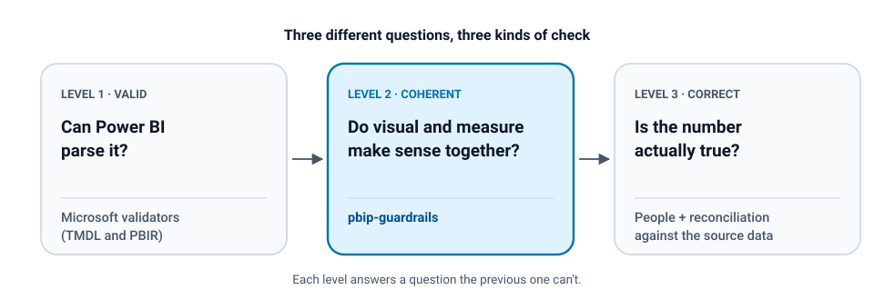

# pbip-guardrails

Lint cross-file coherence issues in Power BI PBIP projects, and publish safely from Linux.

<p align="center">
  
</p>

```bash
pip install "pbip-guardrails @ git+https://github.com/luigiydm/pbip-guardrails.git"
pbip lint path/to/reports
```

On the [broken sample](examples/broken), an excerpt of what it reports:

```text
$ pbip lint examples/broken --family 'Segment (\d+)'
━━ Sales
  coherence checks: 7 finding(s)
  'Pipeline' [filters] cardVisual b0000000000000000001: Order IN ['2L', '3L']
      -> ['Deals at stage'] depend(s) on the row's Order: the value shown may not match the filter
  ...
  'Pipeline' [refs] cardVisual b0000000000000000004: measure 'Total deals' does not exist in the model
  ...
  tmdl: FAIL
           	Detailed error - Unexpected line type: Empty!
           	Document - './tables/Deals'
           	Line Number - 7
  ...
```

7 coherence findings in total, plus a TMDL parser failure and two PBIR layout warnings.

<details>
<summary>See the full output for the broken sample</summary>

```text
$ pbip lint examples/broken --family 'Segment (\d+)'
━━ Sales
  coherence checks: 7 finding(s)
  'Pipeline' [filters] cardVisual b0000000000000000001: Order IN ['2L', '3L']
      -> ['Deals at stage'] depend(s) on the row's Order: the value shown may not match the filter
  'Pipeline' [filters] cardVisual b0000000000000000002: Order IN ['3L', '3L'] (REPEATED VALUES)
      -> a repeated value gives away a hand-edited filter
  'Pipeline' [family] clusteredBarChart b0000000000000000003 mixes 2 families -> 1: ['Deals Segment 1']; 2: ['Avg days Segment 2']
      -> it crosses the figure of one segment with another's (e.g. the volume of one population and the time of another)
  'Pipeline' [refs] cardVisual b0000000000000000004: measure 'Total deals' does not exist in the model
  'Pipeline' [geometry] cardVisual b0000000000000000006: (1150,640) 240x110 is outside the 1280x720 canvas
  'Pipeline' [geometry] clusteredBarChart a0000000000000000004 and clusteredBarChart b0000000000000000005 overlap 98%
      -> same place and same size: the one below can't be seen, usually a leftover duplicate
  [tmdl] Deals.tmdl:6 /// description followed by a blank line
      -> Desktop refuses to open the WHOLE project (InvalidLineType: Empty)
  tmdl: FAIL
    FAIL  TmdlFormatException
           TMDL Format Error:
           	Parsing error type - InvalidLineType
           	Detailed error - Unexpected line type: Empty!
           	Document - './tables/Deals'
           	Line Number - 7
  pbir: OK
    result=succeededWithWarnings  errors=0  warnings=2
    [   1] WARNING PBIR_LAYOUT_OUT_OF_BOUNDS_WIDTH
            'Pipeline' Visual extends beyond page width (x:1150 + w:240 = 1390 > 1280)
    [   1] WARNING PBIR_LAYOUT_OUT_OF_BOUNDS_HEIGHT
            'Pipeline' Visual extends beyond page height (y:640 + h:110 = 750 > 720)
```

</details>

## Valid is not the same as correct

Power BI's project format turned reports into plain text you can diff, review and put
in CI. This project is that CI step, plus a way to publish from Linux that never
overwrites the real report on the first try.

Microsoft can tell you a PBIP is valid. That doesn't mean the report is correct.
There are three different questions, and each needs a different kind of check:

| Level | Question | Who answers it |
|---|---|---|
| **1. Valid** | Can Power BI parse it? | Microsoft's own validators, wired in here as the `tmdl` and `pbir` layers |
| **2. Coherent** | Do the visuals point to measures that exist, and use them in a context where they make sense? | **`pbip lint`'s coherence checks**, which is what this project adds |
| **3. Correct** | Does the number mean what the business thinks it means? | People, and reconciliation against the source data. No linter can answer this |

Level 1 is done well by the official tools and this project doesn't try to replace
them: `TmdlSerializer` (the same parser Power BI uses) catches a model that won't even
open in Desktop, with document and line; the report-authoring CLI checks each file
against its schema and layout rules. Neither is meant to read the DAX of a measure
and the filters of the visual that consumes it *together*, and that pairing is where
level 2 bugs live: the two halves of the contract sit in different folders
(`X.Report` and `X.SemanticModel`).

The sample in [`examples/broken`](examples/broken) contains one level-1 TMDL defect in
the model and five kinds of level-2 coherence defects in the report. Read the two halves
separately. The **model** has a level-1 defect: the official TMDL parser rejects it, as
it should. The **report** is structurally valid: the PBIR validator returns zero errors
and flags only what it's built to flag, the visual that falls outside the canvas. Yet
that same report has coherence defects. The card's filter allows stages 2 and 3, but the
measure's `MAX(Stages[Order])` resolves only stage 3, so the value shown may not match
the context the visual appears to have. Nothing about that is malformed; it's a level-2 problem.

## The coherence checks

The question isn't *"is the report valid?"* but *"is it safe to use this measure under
the context this visual gives it?"*. Always pass the model (it's found automatically
next to the report): it's what turns a suspicion into evidence. The checker reads the
DAX and only reports measures that actually resolve the row with `MAX` / `MIN` /
`SELECTEDVALUE` / `VALUES` / `FIRSTNONBLANK` over the filtered column.

| Check | What it finds | Deliberately NOT reported |
|---|---|---|
| `filters` | a multi-value visual filter on a column that a measure of the same visual resolves with `MAX(...)`; repeated values (`IN (3,3)` = hand-edited); text compared against a numeric column | the visual groups by that table: the row context pins one value |
| `family` | one visual crossing the figure of one population with another's (volume of segment 1 with time of segment 2). Pass `--family` with a regex whose group is the suffix you use | the *same* metric with several suffixes side by side, grouped by stage: that's a deliberate comparison |
| `refs` | measures and columns the report points to that no longer exist in the model | — |
| `geometry` | visuals outside the canvas; one visual almost completely covering another visual of similar size (≥95% overlap) | pairs a bookmark toggles; a small card inside a big chart; grouped and decorative visuals |
| `tmdl` | a `///` description followed by a blank line, without needing .NET | a lone `/// ` line, which is a valid paragraph separator |

The thresholds are tuned so that **every finding means something**: each rule
discounts the legitimate patterns in the right-hand column. If you get hundreds of
findings, the threshold is wrong, not your report: open an issue.

## Publishing without Desktop, on a Pro license

`fabric-cicd` (Microsoft's deployment library) lists `Report` and `SemanticModel` as
item types that don't need Fabric capacity, so a plain **Pro** workspace is enough.

```
PBIP ──safe-copy──▶ ZZ-copy ──publish──▶ Service ──inspect──▶ publish the real one
                    (new name,          (new item,        (refresh,
                     new logicalId)      nothing           open it,
                                         overwritten)      look at it)
```

```bash
# 1. a renamed copy: publishes as a NEW item, the real one is untouched
pbip safe-copy reports/ Sales ZZ-Sales-test /tmp/try

# 2. publish it (device-code login; shows what goes where and asks first)
pbip publish /tmp/try --workspace <workspace-id>

# 3. open it in the Service, force a refresh, look at it. Then publish the real one.
```

What to know before publishing. The first two points were checked against the
fabric-cicd 1.3.0 source; the rest describe behavior observed while publishing, not
guarantees for every tenant or configuration.

- **Existing items are matched by display name, not by id.** A rename in the repo
  creates a second item in the Service instead of updating the first. That's also why
  the `ZZ-` copy is safe: its name doesn't exist yet. (`safe-copy` also gives it a new
  `logicalId`: fabric-cicd rejects duplicates.)
- **`unpublish_all_orphan_items` is never called.** In a shared workspace it would
  delete every item that isn't in your folder.
- **The copy uses `git ls-files --others`.** A plain `cp -r` drags the ignored
  `.pbi/cache.abf` (hundreds of MB); tracked-files-only silently drops the visual
  you added and haven't committed yet.
- **Calculated tables may arrive unprocessed.** In our tests a `DATATABLE` table stayed
  empty after publishing through the API until a refresh was forced.
- **Credentials and gateway binding were kept when updating an existing semantic
  model** (same name) in our tests. A brand-new one needs them configured once.
- Behind a TLS-intercepting proxy (Cloudflare Gateway, Zscaler…), the system CA bundle
  is used automatically.

For unattended CI, use a service principal (`--service-principal` reads
`AZURE_TENANT_ID`, `AZURE_CLIENT_ID`, `AZURE_CLIENT_SECRET`); it must be allowed by
the tenant setting *"Service principals can call Fabric public APIs"* and have a role
in the workspace.

## What no tool here can tell you

There is **no headless Power BI renderer for Linux**. Passing every layer doesn't
guarantee the visuals render: a query can still fail under some filter, a binding or a
permission can be missing. The only real integration test is publishing the `ZZ-` copy
and opening it. That's why the workflow above has step 3.

## Install

```bash
# not on PyPI yet: install from GitHub (or `pip install -e .` in a clone)
pip install "pbip-guardrails @ git+https://github.com/luigiydm/pbip-guardrails.git"              # lint only, pure Python
pip install "pbip-guardrails[publish] @ git+https://github.com/luigiydm/pbip-guardrails.git"     # + fabric-cicd and azure-identity
npm install -g @microsoft/powerbi-report-authoring-cli   # pbir layer
# tmdl layer: .NET 8 SDK. Built once into ~/.cache/pbip-guardrails on first use.
```

Missing external tools are reported as `SKIPPED`; use `--strict` to fail instead.
Exit code is `1` when any layer finds something, so it works as a CI gate. See
[`.github/workflows/pbip-lint.yml`](.github/workflows/pbip-lint.yml).

## Try it on the samples

```bash
python3 examples/make_samples.py    # regenerates examples/healthy and examples/broken
pbip lint examples/healthy --family 'Segment (\d+)'   # exit 0
pbip lint examples/broken  --family 'Segment (\d+)'   # exit 1, seven findings
```

The sample model is self-contained (all tables are `DATATABLE`), so it can be
published to any Pro workspace without a data source or gateway.

## How it was verified

The code was written quickly with an AI agent, so none of it was trusted on its own.
Each step had to be checked against something independent:

1. **A fixture with known answers.** `examples/` is generated by a script: a healthy
   report and a broken one with deliberately planted defects covering every check.
2. **Tests** assert the healthy report gives zero findings and the broken one trips
   every check exactly as many times as planted.
3. **The official tools as a reference.** Microsoft's parser and CLI run on the same
   fixture: the healthy one passes both, the broken TMDL fails where expected.
4. **Parity with the previous implementation.** These checks started as an internal
   script. The generalized version was then run read-only against several real-world
   PBIP projects and had to return exactly the same findings as the original.

## Known limitation

`refs` compares against the `column` / `measure` declarations in
`definition/tables/*.tmdl`. A model that declares objects some other way will report
references that do exist. If a model shows 0 measures, run with
`--only filters,family,geometry`.

---

MIT · Built by [Luis Ivan Payero](https://luisivanpayero.com) while moving Power BI
reports to Git and CI.
